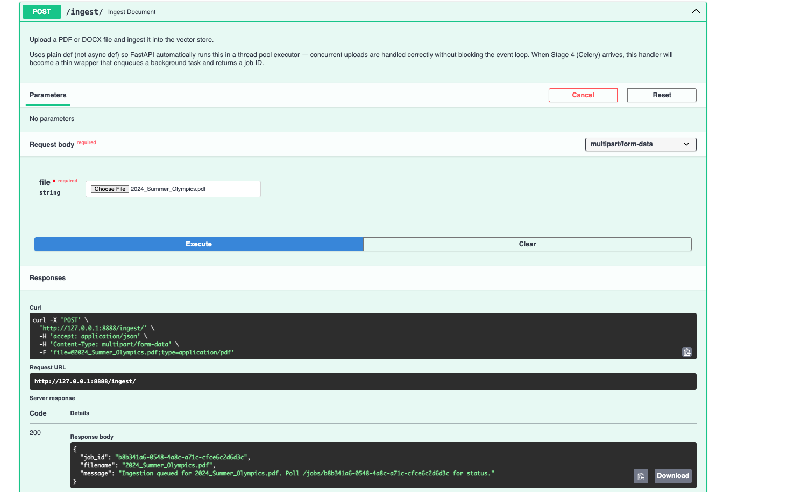
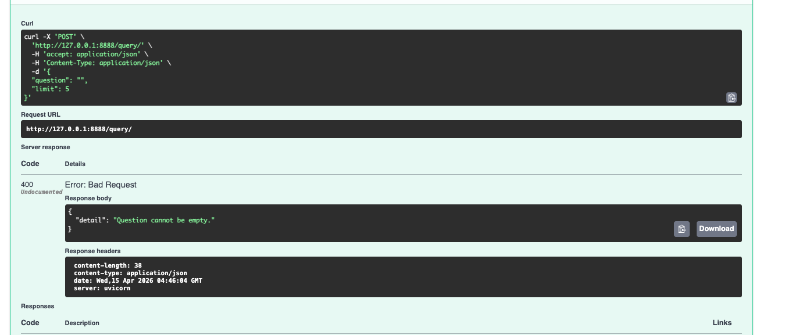

# DocumentProcessingPipeline — Production RAG System
**Status:** Complete · Portfolio project

A production-grade **Retrieval-Augmented Generation (RAG)** pipeline that ingests
PDF and DOCX documents, stores them as searchable vectors, and answers natural-language
questions by retrieving relevant content and synthesizing answers via GPT-4o.

Built with async-first FastAPI, Celery background jobs, TimescaleDB (pgvectorscale),
OpenAI embeddings, and full Langfuse observability.

---

## What it does

1. **Upload** a PDF or DOCX via the REST API
2. **Parse** the document using Docling's structure-aware HybridChunker
3. **Embed** all chunks in a single batched OpenAI API call
4. **Store** vectors in TimescaleDB (pgvectorscale) with metadata
5. **Answer** natural-language questions by retrieving the most relevant chunks
   and synthesizing a response via GPT-4o
6. **Track** every LLM call, token count, and cost via Langfuse

---

## See it working

**Upload returns immediately.** The API hands back a `job_id` so the server never blocks on ingestion.




**Ask a question.** The answer comes back with the model's thought process and an `enough_context` flag.


**When the answer isn't in the documents, it says so instead of inventing one.**


**Bad input is handled, not crashed.**




---


## Tech stack

| Layer | Technology |
|---|---|
| Language | Python 3.13 |
| API | FastAPI + uvicorn |
| Background jobs | Celery + Redis |
| Database | TimescaleDB (pgvectorscale) in Docker |
| Embeddings | OpenAI `text-embedding-3-small` (batched) |
| LLM | OpenAI `gpt-4o` |
| Document parsing | Docling |
| Chunking | Docling HybridChunker + tiktoken |
| Structured output | instructor |
| Observability | Langfuse |

---

## Project structure

```
DocumentProcessingPipeline-RAGbased/
├── docker/
│   └── docker-compose.yml       # TimescaleDB + Redis
├── app/
│   ├── config/settings.py       # Centralised settings (pydantic)
│   ├── database/vector_store.py # Sync + async DB and embedding clients
│   ├── services/
│   │   ├── document_processor.py
│   │   ├── chunker.py
│   │   ├── llm_factory.py       # Sync (Celery) + Async (FastAPI) LLM clients
│   │   └── synthesizer.py
│   ├── api/routes/
│   │   ├── ingest.py            # POST /ingest
│   │   ├── query.py             # POST /query
│   │   ├── documents.py         # GET /documents
│   │   └── jobs.py              # GET /jobs/{job_id}
│   ├── pipeline.py              # Celery ingestion pipeline
│   ├── worker.py                # Celery app + task definition
│   └── main.py                  # FastAPI app entry point
├── requirements.txt
├── example.env
└── .env                         # Not committed — copy from example.env
```

---

## How to run

### Prerequisites

- Docker Desktop
- Python 3.13
- OpenAI API key
- Langfuse account (for observability)

### 1 — Copy and fill in environment variables

```bash
cp example.env .env
# Open .env and fill in your OpenAI and Langfuse keys
```

### 2 — Start Docker (TimescaleDB + Redis)

```bash
cd docker && docker-compose up -d
```

### 3 — Install dependencies

```bash
python -m venv .venv
source .venv/bin/activate        # Windows: .venv\Scripts\activate
pip install -r requirements.txt
```

### 4 — Start the FastAPI server

```bash
cd app
python -m uvicorn main:app --port 8888
```

Swagger UI: **http://127.0.0.1:8888/docs**

### 5 — Start the Celery worker (separate terminal)

```bash
cd app
celery -A worker worker --loglevel=info
```

---

## API endpoints

| Method | Endpoint | Description |
|---|---|---|
| `POST` | `/ingest` | Upload a PDF or DOCX — returns a `job_id` instantly |
| `GET` | `/jobs/{job_id}` | Poll ingestion status (`PENDING / STARTED / SUCCESS / FAILURE`) |
| `GET` | `/documents` | List all ingested documents with chunk counts |
| `POST` | `/query` | Ask a question — returns answer + thought process |

### Example: ingest a document

```bash
curl -X POST http://127.0.0.1:8888/ingest \
  -F "file=@yourfile.pdf"
# Returns: { "job_id": "abc-123", "filename": "yourfile.pdf", ... }
```

### Example: query

```bash
curl -X POST http://127.0.0.1:8888/query \
  -H "Content-Type: application/json" \
  -d '{"question": "What are the key findings?", "limit": 5}'
# Returns: { "answer": "...", "thought_process": [...], "enough_context": true }
```

---

## Database connection (TablePlus or any Postgres client)

| Field | Value |
|---|---|
| Host | localhost |
| Port | 5435 |
| User | postgres |
| Password | password |
| Database | postgres |

---

## Key design decisions

**Two execution paths kept strictly separate**
The FastAPI path is fully async — embedding calls, DB search, and LLM synthesis are
all non-blocking. The Celery worker path stays sync — no event loop, no conflicts.
Each path has its own OpenAI client (`OpenAI` vs `AsyncOpenAI`) and its own
TimescaleDB client (`client.Sync` vs `client.Async`).

**Batch embeddings**
All chunks in a document are embedded in a single OpenAI API call
(`embeddings.create(input=[...all texts...])`) rather than one call per chunk.
For a 50-chunk document this means 1 round-trip instead of 50.

**Embed contextualised, store raw**
`chunk.content` (which includes heading context injected by HybridChunker) is sent
to OpenAI for higher-quality embeddings. `chunk.raw_content` (plain text) is stored
in the DB and returned to users — clean display without the injected context noise.

**Structure-aware chunking**
Docling's HybridChunker respects document structure — headings, tables, and lists are
kept intact rather than being blindly split at token boundaries. This improves
retrieval quality significantly for real-world documents.

**Langfuse drop-in observability**
`from langfuse.openai import OpenAI, AsyncOpenAI` replaces the standard OpenAI
import. Every token count, cost, and latency is tracked automatically with zero
extra instrumentation code.

**Async-first FastAPI with `asyncio.to_thread` for sync boundaries**
The two remaining sync operations in the HTTP path — saving the uploaded file to
disk and polling Redis for job status — are wrapped in `asyncio.to_thread()` so they
never block the event loop.

---

## What "production-grade" means here

This is a reference implementation, not a deployed service. The phrase describes the
engineering patterns it uses, not uptime in front of real users.

**Built in:**

- Fully async request path — embedding, vector search, and synthesis never block the event loop
- Background ingestion through Celery and Redis, so uploads return a `job_id` instantly
- Langfuse tracing on every LLM call, added from the first commit rather than retrofitted
- Typed, env-driven settings with no hardcoded configuration
- Schema-validated LLM output via Instructor and Pydantic, with automatic retries on malformed responses
- Graceful degradation in two places: an `enough_context` flag so the system declines instead of guessing, and a chunker that falls back to raw text rather than truncating when headings overflow the token budget
- Sync and async execution paths kept strictly separate, each with its own clients

**Not yet:**

- No automated test suite
- No CI pipeline
- Dependencies are unpinned in `requirements.txt`
- Responses don't carry source attribution back to the originating document

Those four are the next work on this repo.

---
